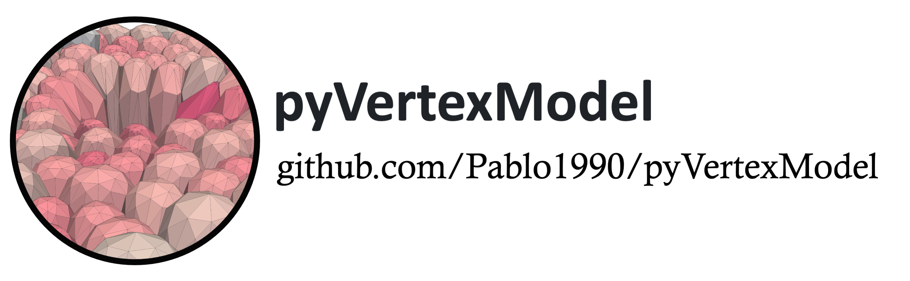

[](https://coveralls.io/github/Pablo1990/pyVertexModel?branch=main)
[](https://codecov.io/gh/Pablo1990/pyVertexModel)

pyVertexModel is versatile 3D vertex model to model tissue and cell mechanics, in particular, regarding tissue repair.

## Environment

```bash
conda create -n pyVertexModel python=3.9
conda activate pyVertexModel
pip install -r requirements.txt
```

## Usage
The first time you run the code, you need to compile the cython code. To do so, run the following commands:
```bash
python setup.py build_ext --inplace
```

To run the code, you can use the following command:
```bash
python main.py
```

## Changing the parameters
You can change the parameters of the model in the `parameters/set.py` file. At the moment, you should change it under 
the 'wing_disc()' function.

Each simulation will be saved in a different folder in the `results` directory. The name of the folder will be the date and time of the simulation.

## Help

For any issues with the code, you can put an issue in the repository.
For other matters, you can contact Pablo Vicente Munuera (p.munuera@ucl.ac.uk).

